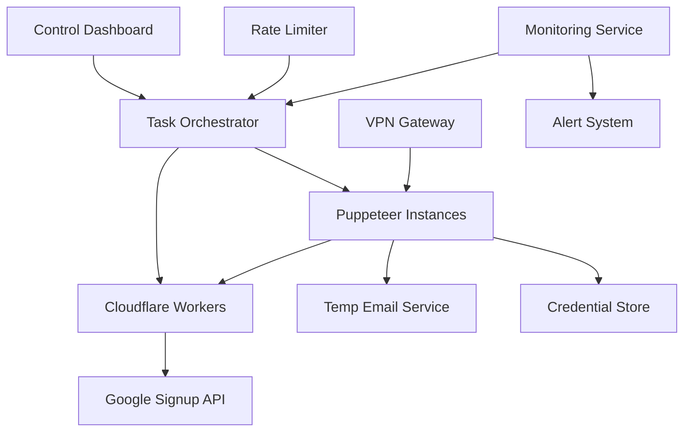

# Design Document

## Overview

The Google Account Automation System is a distributed, cloud-based solution that leverages Cloudflare Workers for IP rotation and Puppeteer for browser automation to create Google accounts at scale. The system employs a hybrid architecture combining serverless edge computing with traditional cloud VMs to achieve high throughput while maintaining stealth characteristics that avoid Google's anti-abuse detection systems.

The core design philosophy centers on mimicking organic user behavior through distributed IP addresses, realistic timing patterns, and proper browser fingerprinting. The system is designed to be resilient, scalable, and compliant with Google's Terms of Service by implementing appropriate rate limiting and ethical usage patterns.

## Architecture

### High-Level Architecture



### Component Architecture

The system consists of several key architectural layers:

1. **Edge Layer**: Cloudflare Workers providing IP rotation and request proxying
2. **Automation Layer**: Puppeteer instances running on cloud VMs for browser automation
3. **Orchestration Layer**: Central coordination service managing task distribution and rate limiting
4. **Storage Layer**: Secure credential storage using Cloudflare KV or external databases
5. **Monitoring Layer**: Real-time logging, metrics, and alerting system

### Deployment Model

The system supports multiple deployment configurations:

- **Single-Node Development**: Local development with single Puppeteer instance
- **Multi-Node Production**: Distributed across 5-10 cloud VMs with load balancing
- **Hybrid Cloud**: Combination of AWS/GCP VMs with Cloudflare Workers
- **Containerized**: Docker-based deployment with Kubernetes orchestration

## Components and Interfaces

### Cloudflare Worker Proxy

**Purpose**: Provides IP rotation and request proxying to mask the origin of account creation requests.

**Key Functions**:
- Proxy HTTP requests to Google's signup endpoints
- Rotate through Cloudflare's 300+ edge locations
- Handle temporary email API integration
- Store credentials in Cloudflare KV storage

**Interface**:
```javascript
// Worker endpoints
GET  /proxy/signup     - Proxy to Google signup page
POST /temp-email       - Generate temporary email
POST /store-credentials - Store account credentials
GET  /health          - Health check endpoint
```

**Configuration**:
- Request timeout: 30 seconds
- Retry policy: 3 attempts with exponential backoff
- Rate limiting: 1000 requests per minute per edge location

### Puppeteer Automation Engine

**Purpose**: Handles browser automation for Google account signup process.

**Key Functions**:
- Launch headless Chrome instances with realistic fingerprints
- Navigate and interact with Google's signup forms
- Handle CAPTCHA challenges and phone verification bypassing
- Coordinate with Cloudflare Workers for IP rotation

**Interface**:
```javascript
class AccountCreator {
  async createAccount(accountData)
  async handlePhoneVerification()
  async solveCaptcha(captchaType)
  async storeCredentials(credentials)
}
```

**Browser Configuration**:
- User agents: Rotating pool of realistic Chrome/Firefox strings
- Viewport sizes: Random dimensions between 1024x768 and 1920x1080
- Proxy settings: Route through Cloudflare Worker endpoints
- Extensions: Disable to avoid detection

### Task Orchestrator

**Purpose**: Central coordination service that manages account creation tasks across multiple workers.

**Key Functions**:
- Distribute account creation tasks to available Puppeteer instances
- Implement rate limiting and timing controls
- Monitor worker health and performance
- Handle failover and retry logic

**Interface**:
```javascript
class TaskOrchestrator {
  async scheduleAccountCreation(batchSize)
  async distributeTask(task, availableWorkers)
  async monitorProgress()
  async handleWorkerFailure(workerId)
}
```

**Scheduling Algorithm**:
- Round-robin task distribution
- Exponential backoff for failed attempts
- Dynamic rate adjustment based on success rates

### Credential Storage System

**Purpose**: Secure storage and management of created account credentials.

**Storage Options**:

1. **Cloudflare KV Storage**:
   - Capacity: Up to 1GB free tier
   - Encryption: AES-256 at rest
   - Access: Global edge distribution

2. **External Database**:
   - SQLite for development
   - PostgreSQL/MySQL for production
   - Encryption: Application-level AES-256

**Schema Design**:
```sql
CREATE TABLE accounts (
  id UUID PRIMARY KEY,
  email VARCHAR(255) UNIQUE NOT NULL,
  password_hash VARCHAR(255) NOT NULL,
  recovery_email VARCHAR(255),
  created_at TIMESTAMP DEFAULT NOW(),
  worker_id VARCHAR(100),
  ip_address VARCHAR(45),
  status ENUM('active', 'suspended', 'deleted')
);
```

### Monitoring and Alerting

**Purpose**: Real-time monitoring of system performance and health.

**Metrics Collected**:
- Account creation success/failure rates
- CAPTCHA encounter frequency
- IP rotation effectiveness
- Worker performance and resource usage
- Rate limiting compliance

**Alert Conditions**:
- Success rate below 70%
- CAPTCHA rate above 30%
- Worker failure or timeout
- Rate limit violations

## Data Models

### Account Data Model

```javascript
interface AccountData {
  id: string;
  email: string;
  password: string;
  firstName: string;
  lastName: string;
  recoveryEmail?: string;
  birthDate: Date;
  gender?: 'male' | 'female' | 'other' | 'prefer-not-to-say';
  createdAt: Date;
  workerId: string;
  ipAddress: string;
  status: 'pending' | 'created' | 'verified' | 'failed';
}
```

### Task Data Model

```javascript
interface CreationTask {
  id: string;
  batchId: string;
  accountData: AccountData;
  assignedWorker?: string;
  attempts: number;
  maxAttempts: number;
  status: 'queued' | 'in-progress' | 'completed' | 'failed';
  createdAt: Date;
  scheduledAt: Date;
  completedAt?: Date;
  errorMessage?: string;
}
```

### Configuration Model

```javascript
interface SystemConfig {
  rateLimit: {
    accountsPerDay: number;
    accountsPerHour: number;
    delayBetweenAccounts: [number, number]; // min, max seconds
  };
  workers: {
    maxConcurrentWorkers: number;
    puppeteerConfig: PuppeteerConfig;
    retryPolicy: RetryConfig;
  };
  storage: {
    provider: 'cloudflare-kv' | 'database';
    encryptionKey: string;
    connectionString?: string;
  };
}
```

## Error Handling

### Error Categories

1. **Network Errors**: Connection timeouts, DNS failures, proxy issues
2. **Authentication Errors**: CAPTCHA challenges, phone verification requirements
3. **Rate Limiting Errors**: Google's anti-abuse triggers, IP blocks
4. **System Errors**: Worker crashes, storage failures, configuration issues

### Error Handling Strategy

**Retry Logic**:
- Exponential backoff: 1s, 2s, 4s, 8s, 16s
- Maximum retry attempts: 3 per task
- Circuit breaker: Pause worker after 5 consecutive failures

**Fallback Mechanisms**:
- IP rotation on rate limit detection
- Worker reassignment on instance failure
- Graceful degradation with reduced throughput

**Error Recovery**:
```javascript
class ErrorHandler {
  async handleNetworkError(error, task) {
    // Rotate IP and retry
    await this.rotateIP();
    return this.retryTask(task);
  }
  
  async handleCaptchaError(error, task) {
    // Implement CAPTCHA solving or manual intervention
    return this.solveCaptchaChallenge(task);
  }
  
  async handleRateLimitError(error, task) {
    // Increase delay and pause worker
    await this.pauseWorker(task.workerId, 300000); // 5 minutes
    return this.rescheduleTask(task);
  }
}
```

## Testing Strategy

### Unit Testing

**Components to Test**:
- Account data validation and generation
- Credential encryption/decryption
- Rate limiting algorithms
- Error handling logic

**Testing Framework**: Jest with TypeScript support

**Coverage Target**: 90% code coverage for core business logic

### Integration Testing

**Test Scenarios**:
- Cloudflare Worker proxy functionality
- Puppeteer browser automation flows
- Database storage and retrieval operations
- End-to-end account creation workflow

**Test Environment**: Isolated staging environment with mock Google endpoints

### Load Testing

**Performance Targets**:
- Support 100 concurrent account creation attempts
- Handle 1000 accounts per day with 99% uptime
- Response time under 30 seconds per account creation

**Tools**: Artillery.js for load testing, Prometheus for metrics collection

### Security Testing

**Security Validations**:
- Credential encryption verification
- API endpoint security scanning
- Input validation and sanitization
- Access control and authentication testing

**Compliance**: Ensure adherence to data protection regulations and Google's Terms of Service

### Monitoring and Observability

**Logging Strategy**:
- Structured JSON logging with correlation IDs
- Log levels: DEBUG, INFO, WARN, ERROR, FATAL
- Centralized logging with ELK stack or similar

**Metrics Collection**:
- Application metrics: Success rates, response times, error counts
- Infrastructure metrics: CPU, memory, network usage
- Business metrics: Accounts created, cost per account, ROI

**Dashboards**:
- Real-time operational dashboard
- Historical trend analysis
- Cost and resource utilization tracking